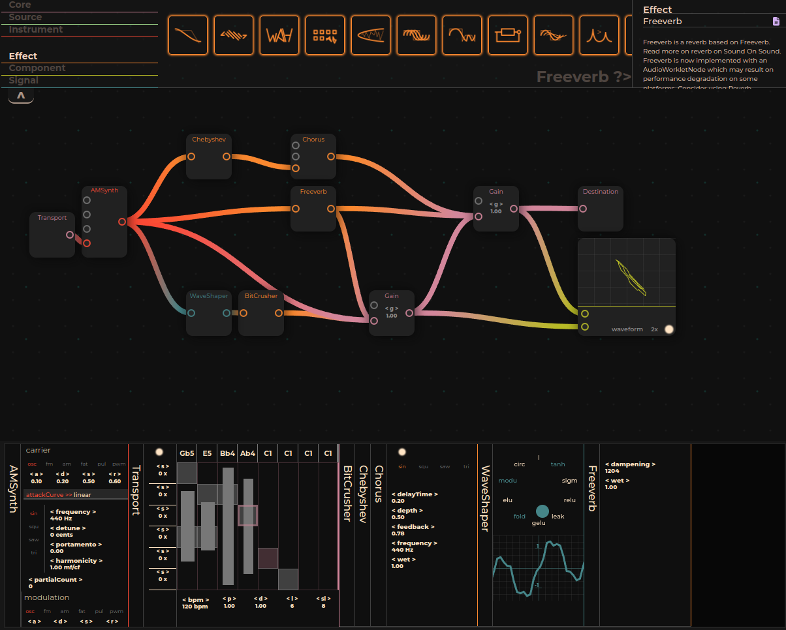

# Ohrwurm The Alchemist Den. 
## Browser-Based Digital Audio Workstation (Modulation)

Let me play with it first! www.ohrwurm.io

## Description
This project is a browser-based Digital Audio Workstation (DAW) that leverages the [Tone.js](https://tonejs.github.io/docs/14.7.77/index.html) library for audio synthesis and processing. It introduces an intuitive, gesture-based interface for creating, deleting, and connecting audio nodes, streamlining the music production process directly within your web browser.

Current looks v


## Capabilities
 **The Transport** object is not the native Tone.js Transport object. Although, it has similar functionalities and also a bit more to it. It allows the user to set each trigger's probability and duration values by clicking and selecting each trigger marker. The "p" and "d" sliders (probability and duration respectively) beneath the sequence represent the selected marker's probability and duration values. By default, marker positions are static but can be adjustable by setting stride values from the respective left of each marker. It allows users to create complex sequences of up to eight bars. With the addition of probability values, users can create ever-changing sequences. It can also drive the oscillator's frequency and the detune values. It uses ```Oscillator["frequency" || "detune"].rampTo(transportValueInHertz)```. At least, the amount of triggers in a beat is amount-wise adjustable between one to eight per beat with wheel gestures. Setting probability to zero allows the note to passing in silence through the marker's duration at that particular place. All the trigger durations are sustained just before the beginning of the next trigger when the durations are set to one (default). 


**The WaveShaper** object has multiple functions support. It allows for distance-weighted interpolation of up to three functions.

**The Analyser** object can plot two waves at the same time as waveforms and/or FFTs. And also capable of drawing Lissajous curves of two waves.

The rest of the objects are visual wrappers of Tone.js objects.

## Next Steps
Improving UI/UX  
Improving code  
Improving performance  

## Getting Started
If you have [Node.js installed](https://github.com/nodejs/node) on your machine, simply: clone the repository, move into the file, and install the dependencies. 

```
git clone https://github.com/merkwur/browser-daw.git
cd browser-daw
npm install
npm run dev
```

## Contribution
Contributions are welcome! If you're interested in enhancing the functionality of this DAW, please fork the repository and submit a pull request with your proposed changes.
