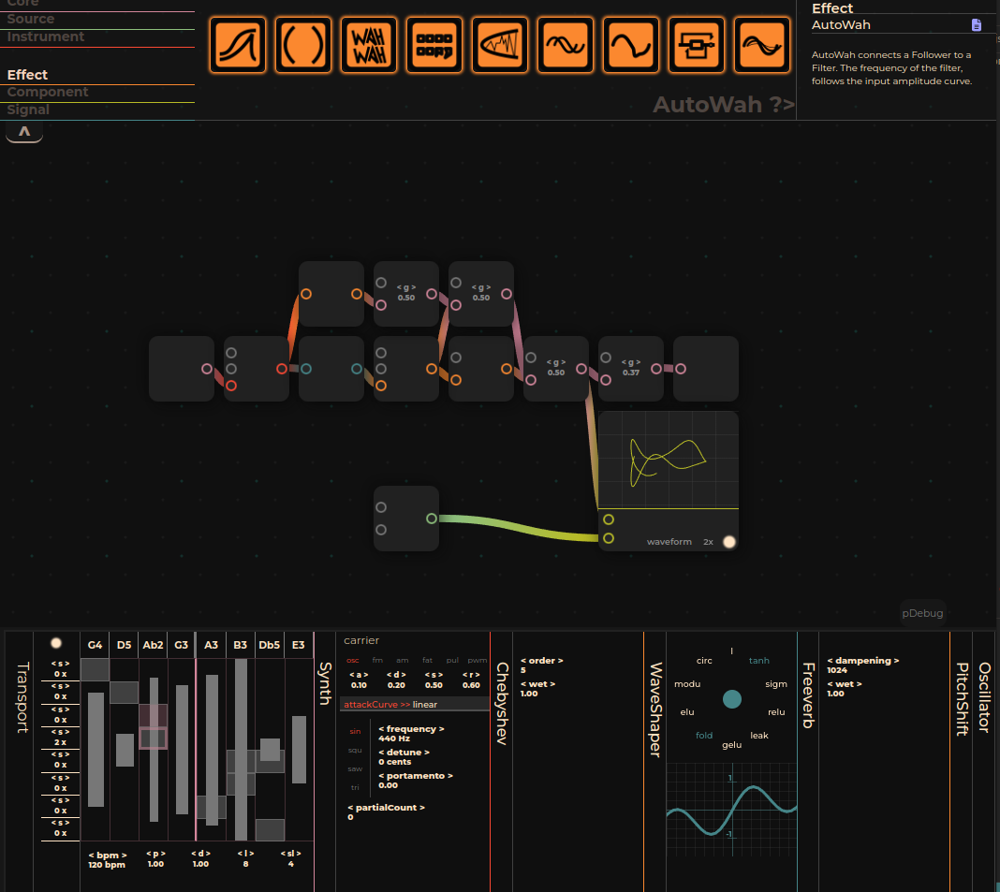

# Browser-Based Digital Audio Workstation (Modulation)

## Description
This project is a browser-based Digital Audio Workstation (DAW) that leverages the [Tone.js](https://tonejs.github.io/docs/14.7.77/index.html) library for audio synthesis and processing. It introduces an intuitive, gesture-based interface for creating, deleting, and connecting audio nodes, streamlining the music production process directly within your web browser.

Current looks v



## Capabilities

 **The Transport** object is not the native Tone.js Transport object. Although it has similar functionalities, and added a little bit more extra capabilities on to it. It allows the user to set the each trigger's probability and duration values individually. By default, beat positions are static but can be adjustable by setting stride values from the respective left of each beat. It allows users to create complex sequences of up to eight bars. With the addition of probability values, users are capable of creating ever-changing sequences. It can also be able to drive not only the synth's frequency but also the oscillator frequency and the detune values. It uses ```Oscillator["frequency" || "detune"].rampTo(transportValueInHertz)``` 

**The WaveShaper** object has multiple funcitons support. It allows to distance-weighted interpolation of up to three functions.

**The Analyser** object can plot two waves at thse same time as waveform also FFT. And also be able to draw Lissajous curves of two waves.

The rest of the objects are visual wrapper of Tone.js objects. 

## Next Steps
Improving UI/UX
Improving code
Improving performance

## Getting Started
If you have [Node.js installed](https://github.com/nodejs/node) on your machine, simply: clone the repository, move into the file, and install the dependencies. 

```
git clone https://github.com/merkwur/browser-daw.git
cd browser-daw
npm install
npm run dev
```

## Contribution
Contributions are welcome! If you're interested in enhancing the functionality of this DAW, please fork the repository and submit a pull request with your proposed changes.